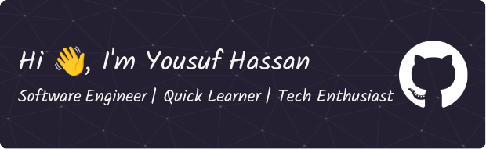

	

 

    

 

  

 
	

## :sassy_man:  About me
- :school: I have completed my `graduation` from the `International University of Business Agriculture and Technology`
- :technologist: I love using Software as a solution for every `Problem`
- :computer: I am a competitive programmer mainly at `Codeforces` and also doing at `Leetcode`, `Codechef`.
- :student: I’m currently learning: `OOP` , `Software Engineering`, `Database Management` and also `Full Stack Development`. 
- :nerd_face: Ready to `learn new things`

 

## :sassy_man: Connect with me

 

	&nbsp
	&nbsp
	&nbsp
	&nbsp

 

## 👀 My Competitive Programming Handles
 

	<h3>Codeforces &nbsp&nbsp Leetcode &nbsp&nbsp Codechef &nbsp&nbsp Beecrowd &nbsp&nbsp Vjudge</h3>	

  &nbsp&nbsp&nbsp
	&nbsp&nbsp&nbsp
	&nbsp&nbsp&nbsp
	&nbsp&nbsp&nbsp&nbsp
	&nbsp&nbsp&nbsp
	 
	<a href="https://github.com/yousuf7902/Problem_Solving.git" style="center"><h3 align="center">Problem Solving Repositories</h2></a> 

## 🛠️ My Skills

### 👉 Programming languages
#### 
C++, C#, Javascript 

 
 &emsp; 
	
  &emsp;
	
  &emsp;
  	 

 
		
### 👉 Frontend Development
#### 
Html5, Css, Tailwind, React 

 
		

 
  &emsp; 
	
  &emsp;
	
  &emsp;
   
  &emsp;
     

 
 
 ### 👉 Backend Development
 #### 
NodeJs, ExpressJs, NestJs, MongoDb, Mysql 

 
 
 
   &emsp; 
	 
   &emsp;
	 
   &emsp;
        
   &emsp;
        
   &emsp;
        

 
	
 ### 👉 Software & Tools
 #### 
Git, Github, Postman, VsCode, VisualStudio 

 

  &emsp;
	
  &emsp;
	
  &emsp;
	 
  &emsp;
	
  &emsp;
	

 	
				
 ### 👉 Competitive Programming & Problem Solving
 #### 
 Codeforces, Leetcode 

 

  &emsp;
    	
  &emsp;
    

 
		
 ### 👉 Operating Systems
 #### 
Ubuntu ,Windows 

 

  &emsp;
    
  &emsp;
    	  

 
		
## 📊 GitHub Profile Stats
 	
  
	
	
	 
  

 

## &#128200; Competitive Programming Stats

 

### ⚡ Recent GitHub Activity
 

 
 

<h2 align="center"> Thanks for visiting my Github Profile. </h2> 
